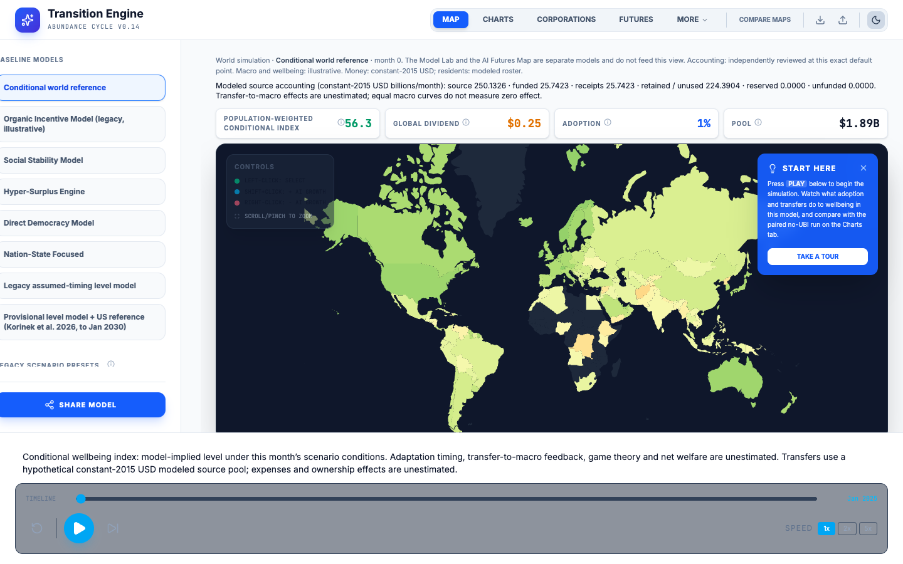
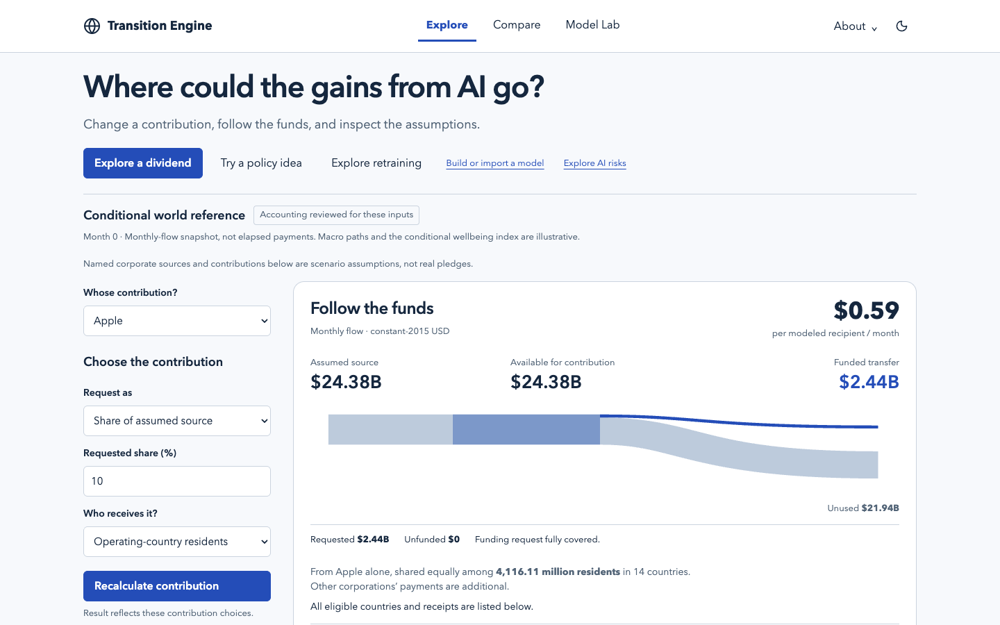
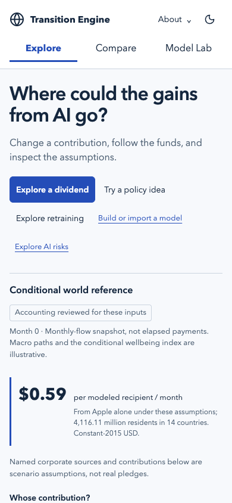

# Morning handoff: clearer entry, preserved depth

**Start with the redesigned local app: http://127.0.0.1:4183/.** Compare the original interface on the same reviewed economic core at http://127.0.0.1:4180/. Both URLs run on Sage’s Mac; they are not public deployments and require the local preview servers to remain running.

The redesign gives newcomers three primary destinations: **Explore, Compare, Model Lab**. Explore starts with a question, a contribution and a visible flow of money. It shows what can be funded and what cannot, then opens paths into policy ideas, training constraints, new variables, imported models and the separate AI-risk model. Existing map, corporation, equation and evidence views remain accessible.

## What is actually shipped

| Work | GitHub state | Public-site state |
|---|---|---|
| Numerical, model-scope, qualification and policy fixes | [PR #17](https://github.com/sagearbor/ai-ubi-wellbeing-transition-simulator/pull/17) merged as `6ff6c51` | Deployment not performed by this task |
| Accurate release/acceptance record | [PR #18](https://github.com/sagearbor/ai-ubi-wellbeing-transition-simulator/pull/18) merged as `d6d0b34` | Documentation only |
| Guided interface | [codex/overnight-guided-experience](https://github.com/sagearbor/ai-ubi-wellbeing-transition-simulator/tree/codex/overnight-guided-experience), draft PR, deliberately unmerged | Local preview only |

The public URL is https://wellbeing-transition-simulator-6icr7acugq-uw.a.run.app/. Its checked asset identifiers still match the pre-release site; its deployed commit is not verified. GitHub merge is not cloud deployment.

## A five-minute comparison

1. Open the redesigned preview. Change Apple’s request to a **monthly amount of 40 billion** and select headquarters-country residents; recalculate. The assumed source permits 24.375 billion and exposes 15.625 billion unfunded. These are hypothetical constant-2015-dollar inputs, not Apple pledges or observed free cash.
2. Open **Assumptions** in that flow, reduce the source share available for contribution and recalculate. Reserved funds remain visible. Compare with zero contributions.
3. Choose **Explore retraining**. Funding, instructors and suitable openings are distinct constraints. More money need not produce more placements. This is an arithmetic model, not evidence that a specific real program will fail.
4. Choose **Try a policy idea**, load the S.3877 worked example and run the pair. Inspect the unresolved mechanisms, then open its Charts. Its source and annual calendar follow it; it does not silently become a world forecast.
5. Use **Add a variable** or **Import a model**. Visit **Explore AI risks**, then return. The tools remain separate where their mathematics and scope differ.

## Before and after

Same starting world scenario, current country dataset and month zero; different entry views. The old global-only dividend and the new Apple-specific receipt are different metrics, not changed model outputs. Build hashes, viewport sizes and image hashes are in [comparison-builds.json](reviews/evidence/guided-2026-09-15/comparison-builds.json).

**Original, desktop**



**Redesigned, desktop**



**Redesigned, phone**



## Evidence and scope

- Complete final local check at integration head `4a212a9`: **1,086 passing tests across 75 files**, all validators, live ledger, source gate and build. GitHub runs the same full command; inspect the draft PR’s check for its actual final head.
- Independent [initial interface review](reviews/2026-09-15-guided-interface-review.md) found three consequential navigation/label defects. [Fix re-review](reviews/2026-09-15-guided-interface-rereview.md) passes all three; [actual browser evidence](reviews/2026-09-15-guided-browser-checks.md) verifies corrected flows, failed B, cancellation, mobile and focus behavior.
- Accounting at **61 exact default monthly points** is independently checked by automated review. The 383-case response audit retains all raw extremes and invalid mappings. This is **not empirical policy or wellbeing qualification**. Source availability, macro paths, the wellbeing bridge and unsupported feedback still carry the documented assumptions.
- Named corporate data remain scenario inputs. Legacy models remain explicit. Published reference misses remain visible; numerical targets were not weakened to get green tests.
- No new provider key or deployment; the owner’s accepted browser-side Gemini-key risk remains.

## Claude Code: continue here

I recommend Claude take the next round after Sage compares the interface. Keep this branch and ask three new users to perform the five-minute flow without coaching. Their failure points should determine the next changes. Another broad speculative rewrite would be less informative than that observation.

Read the [acceptance record](v3-acceptance-2026-09-15.md), [model card](model-card-default.md), [browser report](reviews/2026-09-15-guided-browser-checks.md), and [design decisions](reviews/2026-09-15-overnight-design-decisions.md) before changing model claims or scope.

On this Mac, the existing worktree is `/private/tmp/alignment-guided`. In a terminal:

```bash
cd /private/tmp/alignment-guided
git status --short
git log -5 --oneline
npm run check
```

For a separate checkout, fetch and switch to `codex/overnight-guided-experience` using the repository’s normal worktree workflow. Do not reset or overwrite the existing worktree. To run the redesigned app when the fixed preview has stopped, from that checkout:

```bash
npm ci
npm run build
npm run preview -- --host 127.0.0.1 --port 4183 --strictPort
```

Success is the Explore entry at http://127.0.0.1:4183/ and a passing complete check. If port 4183 is already occupied by the retained preview, use that preview or choose another unused port. Ctrl+C stops a preview you just started; do not kill unrelated processes.

To check the PR without guessing its number:

```bash
gh pr list --repo sagearbor/ai-ubi-wellbeing-transition-simulator --head codex/overnight-guided-experience --json number,url,isDraft,headRefOid
```

Leave this interface PR unmerged until Sage chooses the comparison. Once chosen, review the exact final diff and passing CI, then merge through normal GitHub controls. Deployment is a separate action under Sage’s deployment workflow.

## Prioritized follow-up

1. Observe three first-time users: dividend request, constrained training, partial policy and resume/share. Measure whether they understand the units and limits without explanation.
2. Reduce advanced Lab density based on those observations: progressive steps for model choice, assumptions, results and evidence; preserve all expert tools.
3. Profile initial loading on a throttled connection and defer heavy secondary engines where measured. The current entry remains roughly 0.48 MB gzip plus shared chunks.
4. Obtain independent subject-matter review of transfer/macroeconomic assumptions. Do not promote accounting checks to causal evidence or tune walls to produce politically convenient results.
5. Optional defensive hardening: incomplete conditional output metadata should fall to an unavailable label, even though no supported user route currently produces that state. The reviewer’s exact probe is documented.

## Rulings made during the work

The [ten recorded design decisions](reviews/2026-09-15-overnight-design-decisions.md) include their trade-offs: preserve the world product, qualify accounting narrowly, retain the separate risk model, bind review to actual inputs, preserve complete sharing with explicit limits, merge the functional repairs and keep the interface experiment separate. The coordinator retained local worktrees and preview artifacts for comparison rather than deleting evidence. Nothing was deployed to the cloud.
