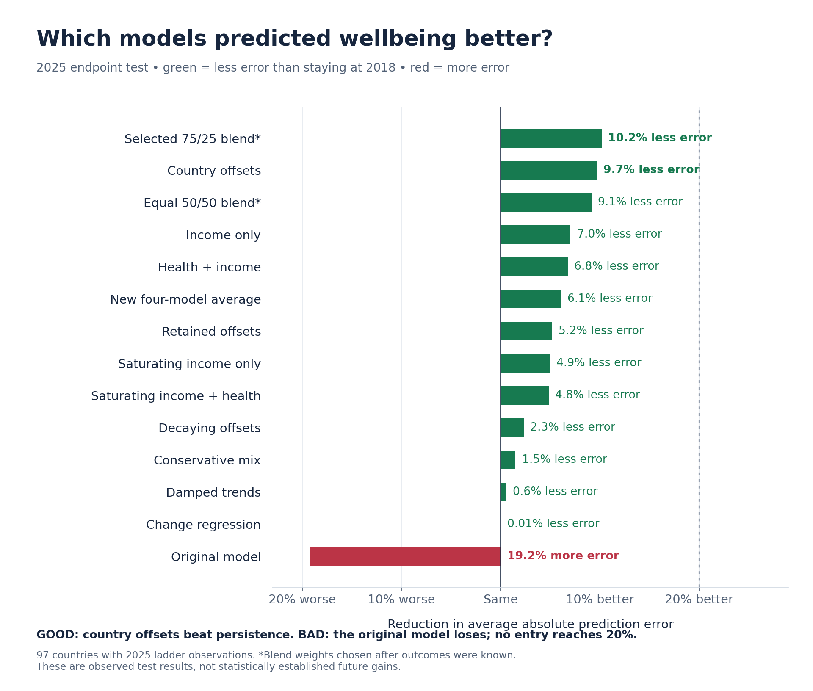
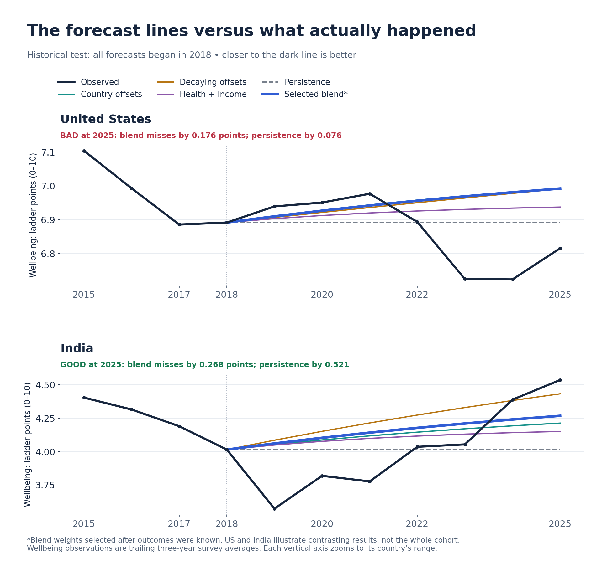
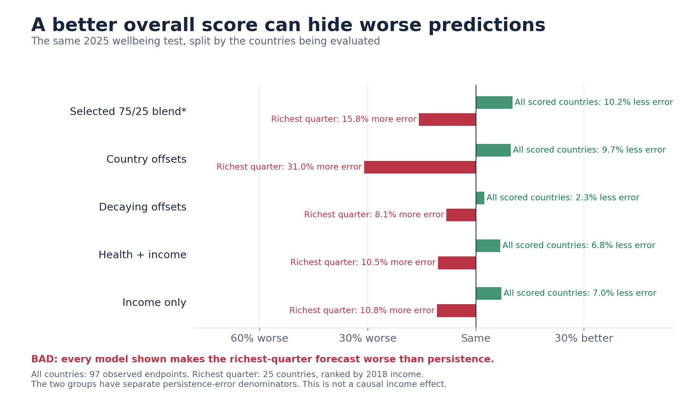
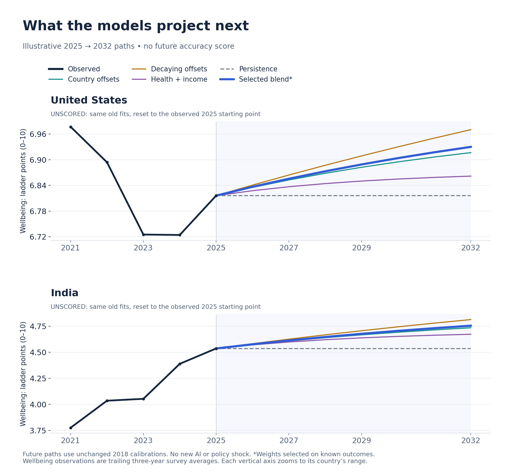
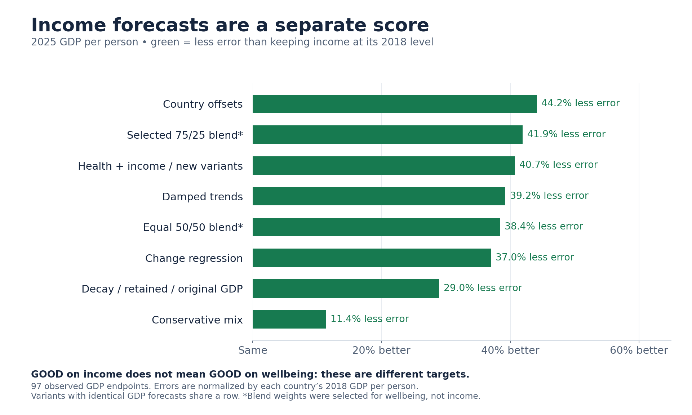

# Which forecasts are good—and which are bad?

**Start with this graph. Green means less prediction error than holding each country at its 2018 value. Red means more error.** These are results on the historical test, not promises about the future.

**My recommendation:** keep country offsets as the research reference. The bold blend is a candidate; its weights were chosen after seeing these outcomes. The new tests did not produce a better model or a 20% wellbeing improvement.

## Did the lines follow reality?

**Dark = observed. Bold blue = the selected blend.** The US example shows a miss; India shows an improvement. An overall average can hide either.

## Where the overall improvement breaks down

The models below improve the overall score but **make predictions worse for the richest quarter of countries**.

## What they project into the future

These start from observed 2025 values and use the unchanged earlier fits. **They are illustrative projections, not verified future predictions.** No AI shock or proposed policy is applied.

## Income is a different result

Income forecasts can beat a flat baseline by much more than wellbeing forecasts. **We do not combine these into one success score.**

What is measured, and what is still uncertain?

- The first chart uses the **2025 endpoint**, with 97 observed countries. Wellbeing error is measured in points on the 0–10 life-evaluation ladder. It is not a percentage of happiness.
- “10% less error” means one tenth less average absolute prediction error than persistence. Persistence keeps each country's 2018 level unchanged.
- Results that average **all seven years** answer a different question and can rank models differently. They are in the full research note.
- The blend was selected from combinations after the outcomes were known. Its historical advantage is not independent proof of future performance.
- The new round was also designed after earlier outcomes were known. Its predictions were frozen before one new score, but the period is no longer an untouched test set.
- The country examples are illustrative. The overall graph covers every available country; no score was recalculated by selecting only these examples.
- The graph images use saved results. Generating this page did not train models or invoke another scoring run.
- These research findings have not changed the production app.

[Full research note](../research/2026-09-16-health-income-diagnostic.md) · [Interactive HTML source](2026-09-16-forecast-paths.html) · [PR #33](https://github.com/sagearbor/ai-ubi-wellbeing-transition-simulator/pull/33)

