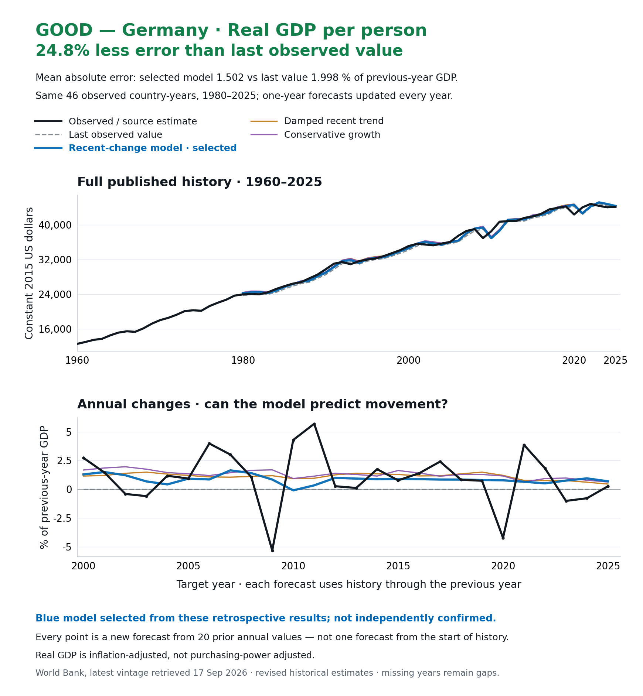
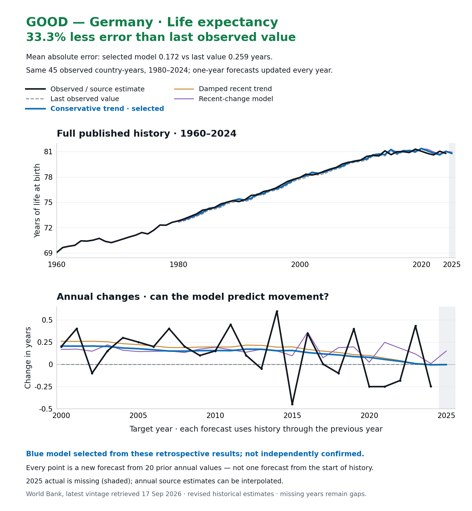
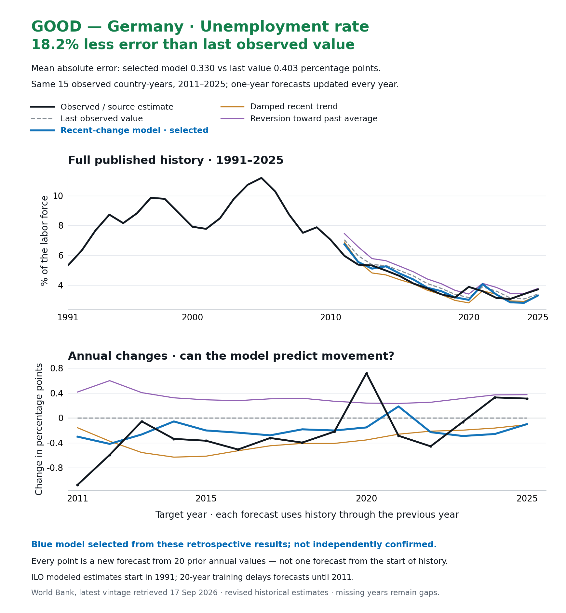
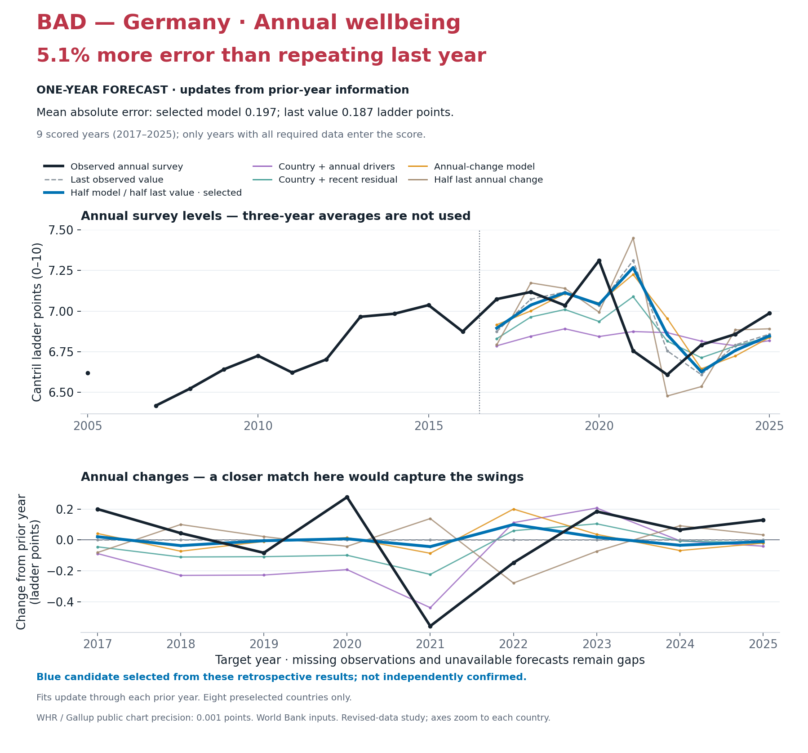
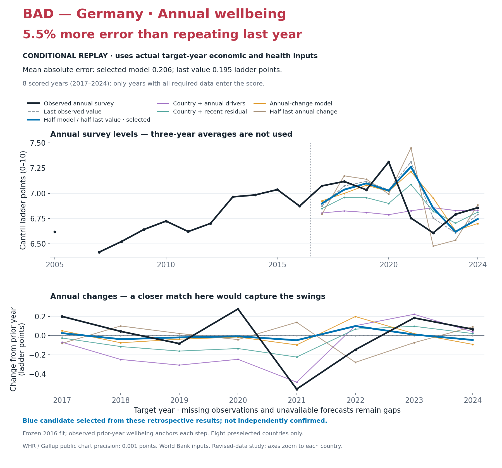

# Germany: annual historical predictions

[Back to the main visual review](../2026-09-17-annual-history-graphs.md)

**Black = observed/source estimate. Blue = highlighted model. Dashed gray = repeat the last observation.** The blue candidate was selected by the whole study’s pooled error, not chosen separately to flatter this country. Every forecast point updates from previous-year information; this is not one uninterrupted forecast from 1960.

Each figure includes a **change panel**: that is where missed spikes become visible. The GOOD/BAD label refers to average error on identical observations, not proof of reliable future or policy effects.

## Income per person

**GOOD: 24.8% less error than repeating last year.**

## Life expectancy

**GOOD: 33.3% less error than repeating last year.**

## Unemployment

**GOOD: 18.2% less error than repeating last year.**

## Wellbeing: one-year forecast

**BAD: 5.1% more error than repeating last year.** This is the annual 0–10 life-evaluation survey score, not a blend of GDP, lifespan and unemployment.

## Wellbeing: reconstruction using known annual conditions

**Conditional replay:** the model receives the actual target-year GDP, life-expectancy and unemployment inputs, plus observed previous-year wellbeing. Coefficients stay frozen at 2016. This is a sequence of one-year reconstructions, not an advance forecast of those conditions. Missing requirements cause gaps.

Its scoring years and fitting rule differ from the forecast above; do not read the two pooled errors as a controlled test of the value of knowing the inputs.

**Sources:** World Bank annual constant-2015-dollar GDP per person, total life expectancy and modeled ILO unemployment; World Happiness Report / Gallup public annual chart transcriptions. Latest revised source data, not historical release vintages. Life-expectancy observations stop at 2024; unemployment starts in 1991 and its forecast test starts in 2011. Missing values are not interpolated by these experiments.

[Methods, full results, sources and limitations](../2026-09-17-annual-history-graphs.md#methods-and-checks)
